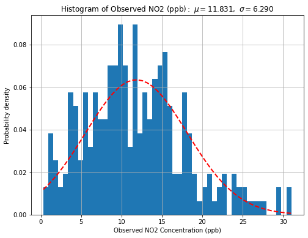

# 1. Introduction

NO2 is defined by the U.S. Environmental Protection Agency (EPA) as a criteria air pollutant, meaning it poses a risk to human and environmental health.  The primary National Ambient Air Quality Standard (NAAQS) for NO2 is set at a 53 ppb annual average [@https://www.epa.gov/no2-pollution/primary-national-ambient-air-quality-standards-naaqs-nitrogen-dioxide]. NO2 can cause respiratory irritation and can aggravate respiratory diseases such as asthma [@https://www.epa.gov/no2-pollution/basic-information-about-no2#What%20is%20NO2]. NO2 can also react with other chemicals in the atmosphere to form both particulate matter (PM) and tropospheric ozone (O3) (US EPA, n.d., B). PM and O3 are also criteria air pollutants and are harmful to human health. NO2 also contributes to the formation of acid rain, smog, and nutrient pollution in coastal waters [@https://www.epa.gov/no2-pollution/basic-information-about-no2#What%20is%20NO2]. The primary source of NO2 emissions is fossil fuel combustion, particularly from traffic and power plants [@https://www.epa.gov/no2-pollution/basic-information-about-no2#What%20is%20NO2]. 

Therefore, understanding and predicting the spatial variability of NO2 emissions is of great importance to public health. However, prediction of air quality can be complicated due to the number of factors that affect local air quality, ranging from meteorology to land use. Machine learning models are a useful tool to interpret and find relationships in complex data. 

Bechle et al (2015) explores the impact of.. [@https://doi.org/10.1021/acs.est.5b02882] Grace

This report proposes a machine learning model to predict NO2 concentrations spatially. First, a literature review was undertaken to understand what machine learning models have typically performed well in predicting air quality. Next, an exploratory data analysis (EDA) was performed on the Bechle et al (2015) dataset. Finally, multiple linear regression, neural network and random forest models were built and results were compared to see which method had the lowest mean-squared error (MSE). 

# 2. Methods
## 2.1 Literature Review
There are a number of studies examining how machine learning models can be used to predict air quality. Seven studies were examined as part of this literature review, and can be broadly categorized into 2 areas: predicting PM2.5 and predicting the Air Quality Index (AQI)/ Air Pollution Index (API). One exception is that one of the studies examining AQI also predicted NOx concentrations. 

### 2.1.1 PM2.5
Chen et al (2018) explored the use of random forest (RF) models to predict PM2.5 concentrations spatially in China and compared them to multiple linear regression (MLR) and generalized additive models [@https://doi.org/10.1016/j.scitotenv.2018.04.251]. While the study began with a large number of predictors, these were narrowed down to ground-based measurements, satellite retrieved AOD data, urban cover data and  meteorological data. The random forests model had the greatest predictive power of all the models considered, with a root mean squared error (RMSE) of 28.1 µg/m3 on a daily scale (R2 = 83%), improving to 10.7 µg/m3 (R2 = 86%) and 6.9µg/m3 (R2 =86%) on monthly and annual time-scales, respectively. 

Xu et al (2018) likewise considered a number of machine learning models for PM2.5 prediction in British Columbia, Canada [@https://doi.org/10.1016/j.envpol.2018.08.029]. 8 models were examined in this study:  1) MLR, 2) Bayesian Regularized Neural Networks (BRNN), 3) Support Vector Machines with Radial Basis Function Kernel (SVM), 4) Least Absolute Shrinkage and Selection Operator (LASSO), 5) Multivariate Adaptive Regression Splines (MARS), 6) RF, 7) eXtreme Gradient Boosting (XGBoost), and 8) Cubist.The predictors included humidity, temperature, albedo, normalized difference vegetation index (NDVI), height of the planetary boundary layer (HPBL), wind speed, distance to the ocean, elevation, and calendar month beside the ground level monthly averaged P2.5 data collected from 63 stations between 2001 to 2014 as well as 3km resolution aerosol optical depth (AOD) data from Moderate Resolution Imaging Spectroradiometer (MODIS). This study found that the cubist model had the highest accuracy (RMSE=2.64 µg/m3 and R2=0.48) and the the MLR had the lowest accuracy (MSE = 3.24 µg/m3 and R2=0.22). The predictors with the most influence were monthly AOD and elevation. 
 
Enebish et al (2020) considered 6 different machine learning models for PM2.5 prediction in Mongolia: 1) RF, 2) gradient boosting, 3) SVM with a radial basis kernel, 4) MARS, 5) generalized linear model with elastic net penalties (a type of MLR), and 6) generalized additive model [@https://doi.org/10.1038/s41370-020-0257-8]. These models were run for annual data, cold season and warm season. Parameters considered were air pollution monitoring data, meteorology, land use and population. Across all time periods, the RF had the best R2 and RMSE values. Over the entire period using the hold-out test set, RF had a RMSE of 12.92 (R2 = 0.96), and the cold season and warm season had RMSE of 21.23 (R2 = 0.92) and 7.44 (R2 = 0.84), respectively. 

### 2.1.2 AQI/API
Azid et al (2014) used a multilayered perceptron feed-forward artificial neural network model to predict API, using daily measurements of NO2, SO2, CO, PM10 and O3 over a period of 7 years in Malaysia [@https://doi.org/10.1007/s11270-014-2063-1]. The best RMSE and R2 occurred when the hidden nodes were set to 6, and were 0.618 and 10.017, respectively. 

Gu et al (2020) focuses on predicting the AQI in Shenzen, China [@https://doi.org/10.1007/s00521-019-04492-3]. The dataset consists of 365 sets of daily pollution data over one calendar year (2018), and the purpose was to develop a model to predict AQI. Pollution measurements included PM2.5, PM10, SO2, CO, NO2 and O3. Two SVM models were developed: smart adaptive particle swarm optimization and particle swarm optimization, SAPSO-SVM and PSO-SVM, respectively. Additionally, a back propagation (BP) neural network model was developed. SAPSO-SVM had a test set classification accuracy of 91.62%, and PSO-SVM 88.56%. For the BP-neural network model, ten iterations of the algorithm best fit the test data set, where the percent error ranged from 18.41% for PM2.5 to 30.29% for SO2. While Gu et al stated that both models were a good fit for the data, by using different statistical comparisons to explain model fit, it is not clear which of the two models has a better predictive ability, although it appears to be SAPSO-SVM. The paper listed a number of limitations associated with its neural network, particularly the limited data points. 

Singh et al (2013) used ensemble learning methods to predict air quality index in Lucknow, India [@https://doi.org/10.1016/j.atmosenv.2013.08.023]. They trained four different models: single decision tree (SDT), decision tree forest (DTF), decision treeboost (DTB) and SVM. While decision trees can be different from random forest, it appears in Singh’s methodology that the DTF and DTB involve randomization with replacement from the training dataset to create separate models, which are then used to predict the entire data from the subsets. This is consistent with RF models, as essentially RF are ensemble decision trees. The parameters included in the model are 5 years of data on: daily air quality measurements (SO2, NO2, suspended particulate matter and respirable suspended particulate matter) meteorology (air temperature, relative humidity, wind speed, evaporation, and daily sunshine period).  The DTF and DTB models outperformed the SVM models. DTB performed the best, with a RMSE of 4.38 (R2 = 0.92).

Liu et al (2019) developed SVM and RF models to predict hourly AQI in Beijing, China and hourly NOx in an Italian city [@https://doi.org/10.3390/app9194069]. Parameters included historical hourly averaged AQI concentrations for PM2.5, O3, SO2, PM10 and NO2 in Beijing (five years), and hourly averaged responses for CO, non-methane hydrocarbons, benzene, NOx and NO2 in the Italian city (1 year). The SVM performed better in predicting AQI in Beijing with a RMSE 7.666 (R2=0.9776), but the RF model performed better in predicting NOx concentrations in the Italian city (RMSE = 83.67, R2 = 0.8401).  

## 2.1.3 Comparison of PM2.5 and AQI/API studies
The main difference between the PM2.5 and the AQI studies is that studies examining PM2.5 tended to only examine one pollutant, whereas AQI studies consisted of measuring and modeling a number of different pollutants. Therefore, some AQI models were more interested in classification than predicting a specific pollutant spatially or temporally. As a result, different parameters tended to be included in the model depending on if it was predicting PM2.5 or AQI. For example, meteorological data tended to be included in PM2.5 studies, but not in studies examining API/AQI.  Additionally, different types models tended to perform best depending on the target prediction. 

A common limitation of all of the studies is the volume of missing data. In Chen et al (2018), the model had only two years of ground-based measurements to train the model on (2014-2016), and then predicted PM2.5 concentrations for a ten year period (2005 to 2014) [@https://doi.org/10.1016/j.scitotenv.2018.04.251]. Xu et al, 2018 also discussed the challenge of missing data, averaging hourly and daily measurements where available to monthly concentrations to use in model development [@https://doi.org/10.1016/j.envpol.2018.08.029]. Enebish et al, 2020 discussed there being few air quality monitoring stations and insufficient data to well represent the high seasonal variability of PM2.5 concentrations [@https://doi.org/10.1038/s41370-020-0257-8]. Additionally, Gu et al (2020) only used pollution data from one year within one region in China[@https://doi.org/10.1007/s00521-019-04492-3], and Liu et al (2019) used pollution data from one Italian city over one year [@https://doi.org/10.3390/app9194069].

The models in each of these studies is summarized in Table 2.1 below:

**Table 2.1 Models used in literature** 

|PM2.5|Both PM2.5 and AQI|
|-----|------------------|
|**MLR** (Xu et al, 2018; Enebish et al, 2020; Chen et al, 2018) | **RF** (Chen et al, 2018; Xu et al, 2018; Singh et al, 2013; Liu et al, 2019; Enebish et al, 2020)|
| **LASSO** (Xu et al, 2018) |  **Neural Network** (Azid et al, 2014; Xu et al, 2018, Gu et al, 2020) |
| **MARS** (Xu et al, 2018; Enebish et al, 2020 ) | **SVM**  (Xu et al, 2018; Gu et al, 2020; Liu et al, 2019; Enebish et al, 2020; Singh et al, 2013) | 
| **Gradient Boosting** (Xu et al, 2018; Enebish et al, 2020) | |
| **Cubist** (Xu et al, 2018) | |
| **Generalized additive model** (Enebish et al, 2020; Chen et al, 2018)| |
| **Mixed effects models** (Chen et al, 2018) |  |

As we can see above more models were used to predict PM2.5 than AQI, and the ones that were used in AQI studies were also used in predicting PM2.5. The best-predicting models in each study are shown in Table 2.2, alongside their RMSE and R2 values. 

**Table 2.2 Best models in each study**

| Study | Target Prediction | Best Model | RMSE | R2 |
|-------|-------------------|------------|------|----|
|Chen et al (2018)[@https://doi.org/10.1016/j.scitotenv.2018.04.251] |Annual average PM2.5|Random Forest|6.9|0.86|
|Xu et al (2018)[@https://doi.org/10.1016/j.envpol.2018.08.029] |Monthly average PM2.5|Cubist|2.6|0.48|
|Enebish et al (2020)[@https://doi.org/10.1038/s41370-020-0257-8] |Annual average PM2.5|Random Forest|12.9|0.96|
|Azid et al (2014)[@https://doi.org/10.1007/s11270-014-2063-1] |Daily AQI|Neural network|10.0|0.62|
|Gu et al (2020)[@https://doi.org/10.1007/s00521-019-04492-3] |Daily AQI|SVM|n.a.|n.a|
|Singh et al (2013)[@https://doi.org/10.1016/j.atmosenv.2013.08.023] |Daily AQI|Random Forest|4.4|0.92|
|Liu et al (2019)[@https://doi.org/10.3390/app9194069] |Hourly AQI|SVM|7.7|0.98|
|Liu et al (2019)[@https://doi.org/10.3390/app9194069] |Houly NOx|Random Forest|83.7|0.84|

Table 2.2 demonstrates that RF models tend to provide the most accurate prediction when considering a single pollutant, with 3/4 studies looking at PM2.5 or NOx having RF as the best predicting model. When examining AQI, SVM models tend to work best, with 2/4 studies finding SVM provides the best prediction. 

The RMSE and R2 values vary significantly for each study. This can be attributed to the different geographic areas considered, varying spatial resolutions, amount of uncertainty in the data sources, prediction type and different parameters included in the model. 

Because the objective of this study is to predict a single variable (NO2 concentrations), then the models used by PM2.5 studies are the most relevant. Therefore, in our model analysis, we will use MLR, neural networks and RF. 

## 2.2 Exploratory Data Analysis
The target variable in this predictive case is NO2 concentration in the continental United States. The observations from the data have a mean NO2 concentration of 11.831 ppb with a standard deviation of 6.290 ppb. The NO2 concentration data has a range from 0.309 to 31.016 ppb. The five highest values are considered outliers. The distribution of NO2 concentration values is unimodal with a slight right skew.

The potential explanatory variables of air quality monitor IDs, states, latitude, longitude, and WRF-Chem+DOMINO each exist as single columns. The variables related to land-use of impervious surfaces, population, major road length, residential road length, and total road length each have several columns quantifying these values based on the radius from the air quality monitor. The impervious surfaces, population, and major road length variables have 22 columns each based on radii ranging from 100 to 10,000 meters. The variables minor road length and total road length have 30 columns each based on radii ranging from 100 to 14,000 meters.

The spatially-related data of latitude, longitude, and state of air quality monitors can be best interpreted by viewing this data plotted on a map. Each observation corresponds to a unique monitoring station at a distinct longitude and latitude, so there are 255 points. Monitors in this dataset come from 43 of the 50 states in the USA, excluding Alabama, Alaska, Hawaii, Mississippi, Montana, Oregon, Nebraska, and West Virginia. Many of the states. Many states have just one or two monitors, while nearly half of all of the monitors are in the three states California, Texas, and Pennsylvania. Observing Figure 2.2, there are many spatial gaps in the data and little discernible correlation between position and NO2 quantity.

Figure 2.3 is a correlation matrix for the variables in this data set. The five land-use variables are aggregated such that each of the series of related covariates differentiated by radius are instead one column. As seen in the plot, each of the land-use variables has a moderately strong positive correlation with NO2, as well as the variable WRF+DOMINO. The impervious surfaces, major road length, residential road length, and total road length variables each have a heteroskedastic relationship with NO2 with higher variability occurring when paired with larger NO2 values. Each of these relationships show a stronger correlation when measured with a Spearman’s correlation as opposed to the Pearson’s correlation used in the matrix. The three road-related variables are related and highly correlated with each other. The variable of population is highly skewed and has an exponential relationship with NO2. This correlation is stronger when a log-transformed population is paired with NO2. The variables of distance to coast and truncated elevation have a very weak correlation with NO2.

 

## 2.3 Model
### 2.3.1 Multiple Linear Regression
-> Grace add here

### 2.3.2 Neural Networks
Artifical neural networks are based on the design philosophy of the neural connections in our brain. They consist of a group of nodes interconnected to each other through edges. The edges transmit the signals (which in a machine learning model would be a real number) from one neuron to another just like a synapse functions in a brain.

A typical neural network has many layers. Each layer is composed of a set of neurons and each layer transforms and processes data in a different way based on the hyperparameters of the model.

There are different kinds of neural networks. The most commonly used of which are:
1. Feed Forward Neural Network
2. Convolutional Neural Network (CNN)
3. Recurrent Neural Network (RNN)
4. Long-short term memory neural network (LSTM)
5. Gated Recurrent Unit (GRU)

There are several other advanced ones such as General Adversarial Networks,Auto-encoders and Deep Belief Neural networks.

We will first discuss, briefly, the CNN, RNN, LSTM and GRU before moving on to the Feed formal neural network which is the neural network model used in this project.
#### 2.3.2.1 CNN
Largely used for classifying image and audio data, the convolutional neural network, similar to neural networks has an input and output layer with hidden layers in between them. Further, a CNN has three layers called convolutional layer, pooling layer and a fully-connected layer which is similar to the regular neural network. The convolutional layer takes the input from the input layer and convolutes the data and sends it downstream for further processing. In simpler terms, in CNNs an input image is taken and a filter is applied on it repeatedly acorss the image to create a feature map which can be used to identify and classify the input image [@https://arxiv.org/abs/1511.08458].

#### 2.3.2.2 RNN
These neural networks are used to predict the temporal trend of the data.In these kind of models, the 'memory' of the previous inputs of is stored and used for further processing of future inputs and outputs.This relationship between input and output data could be both unidirectional (moving in the forward direction) or bidirectional where future data could also be used to improve the current inputs and outputs.These neural networks could use a variety of relationships between their inputs and outputs and could be described as one to one, one to many, many to many and many to one relationships. Sigmoid, ReLu, Tanh are the common activations used in RNNs [@https://arxiv.org/abs/1506.00019v4].

#### 2.3.2.3 LSTM
LSTMs are a type of RNN which solve the common problems that RNNs face, that is their inability to efficiently handle short-term memory over a lengthy series of steps. LSTMs solve this problem using a memory cell and gating units and consists of a set of gates called input, output and forget.The input gate is responsible for monitoring and deciding the kind and quantity of data that is allowed to enter the cell, the memory gate is responsible for deciding the proportion of data that should be 'forgotten' and which information is useless and to be discarded. Finally, the output gate is responsible for deciding the amount of data that is passed as output from the cell [@https://arxiv.org/abs/1808.03314v7].

#### 2.3.2.4 GRU
GRU is similar to LSTMs with the exception that an output gate is absent. Instead it has a reset and update gates. The reset gate works as a combination of input and forget gate and the update gate works as an additional forget gate. Their performance is equivalent and sometimes even better than LSTMs, especially when dealing with some infrequent data[@https://arxiv.org/abs/1412.3555v1].

#### 2.3.2.5 Neural networks used in this project
In this project, majority of our group members used simple feed forward neural network models. This decision was based on two reasons:
1. The literature search revealed that neural network models are one of the most widely used models especially in pollution prediction problems and they performed relatively better in a large number of cases
2. Neural networks are simpler as compared to random forests but at the same time slightly more complex than linear regression and hence they involve machine learning components

Among the neural network models we used a combination of different features and hyperparameters. We used keras, which is an opensource library of functions which allows the use of the tensorflow library for machine learning models in python. The building blocks of a neural network model such as layers, objective functions,activation functions and optimizers, are all provided by keras. 

A regular neural network consists of an input layer, hidden layers and an output layer. We used a sequential model which consists of few layers stacked upon one another, linearly [@https://doi.org/10.1016/S0169-7439(97)00061-0]. Each layer has multiple cells and we could define the number of input cells for these hidden layers. We can also define the type of activation function for each layer. We used an average of 3 to 5 hidden layers in our neural network models.

We used a combination of three different activation functions:
1. Linear Activation - a linear activation uses the weights to multiply the inputs providing an output which is linearly proportional to the input. This function is also termed as no activation function as there is no further transformation being operated on the values
2. ReLU - Rectified Linear Activation Unit - even though very similar in appearance to a linear, ReLU allows back-propagation of errors. This function always gives an output of 0 for negative values and behaves linearly for values greater than 0.
3. Sigmoid activation - by implementing this activation function, the outputs are normalized and bound between 0 and 1 but provides a smooth gradient curve and much clearer predictions

Further, the compile function is used to compile the model created and takes in a variety of arguments. We used an Adam optimizer. Adam optimizer uses the combination of squared and moving average gradients to individually compute the learning rates for each parameter. As such it provides the benefits of both RMSProp and Stochastic Gradient Descent.

We chose a learning rate of 0.0005 to 0.005. Learning rate is an essential hyperparameter that influences the weights of a model and the extent to which they are updated. A very low learning rate could lead to a model being very slow and eventually unable to reach the desired result and at the same time, a very high learning rate could make worsen the model by making it unstable and inaccurate and eventually lead to inferior quality of weights.

Both absolute error and root mean squared error were chosen as the loss functions.

The final step was to train our model so created using training dataset and the keras function model.fit. An important parameter for fitting the model is epoch which indicates the number of times the training dataset is run through our model. For example, if we choose 500 epochs we are allowing the training data to run through the model for 500 times. The number of epochs determine how well the model familiarizes itself with the model. Greater the number of epochs the better the model understands your data.

However, it must be ensured that excessive epochs in proportion to the complexity of the model and the dataset is avoided as this could result in a situation wherein the model no longer tries to find a pattern among the data but rather simply memorises it. In such situations, the model overfits the data. We used a range of epochs between 350- 1000.

Usually, training dataset is split into training and validation dataset to resolve the problem of overfitting if encountered. A validation dataset also allows for considerable improvements in model before the model is fit using the test data. A common practice is to split the training data in such a way that 80% of the data is used to train the model and 10-20% to validate. We used a 10-20% split. However, our best performing neural network model did not use any validation data citing the limited number of datapoints available for the competition.

Our neural networks achieved a RMSE values in the range of 2.92-6.6. The best performing neural network model is described in detail in the Results section of the report. The details about the neural networks are summarised in Table 2.3

**Table 2.3 Summary of 3 Neural Networks Used in the project (the fourth and the best performing is explained in detail in the Results Section)**

|Features|Hyperparameters|Group Member|FInal RMSE Achieved|
|--------|---------------|------------|-------------|
|WRF+DOMINO, percentage impervious surface,	population,	major road length,	resedential road,	total road: All at buffer 10000 m|learning rate = 0.0004; batch size = 120; hidden layers = 4; epochs = 350|Sudheer|6.60|
|WRF+DOMINO,	impervious percentage,	population,	major road length,	resedential road,	total road: All at buffer 10000 m|learning rate = 0.001; hidden layers = 1; epochs=2000|Hope|4.23|
|WRF+DOMINO, percentage impervious surface at buffers 3000,3500,4000,5000,6000,7000,8000,10000 m|learning_rate = 0.005; epochs = 400; hidden layers = 4; batch_size = 100| Tessa|4.33|

### 2.3.3 Random Forest
Trees and tree algorithm is among the most widely applied machine learning algorithms. It includes random forest, gradient boosting decision trees, XGBoost, etc. The fundament of trees algorithm is decision tree, which can be divided into classification tree and regression tree. In this project, the label is the observed NO2 concentration, thus, regression tree algorithm can be applied to make the prediction.

Random forest is a combination of tree predictors based on model aggregation ideas. It is realized by creating an ensemble of trees by generating random vectors that govern the growth of trees and letting them vote for the most popular label [@Breiman2001]. 

Random forest have the advantages of low overfit, low noise affect. However, for random forest regression,  a relatively large number of features are required to reduce the test set error[@Breiman2001].

Variable selection and feature engineering are very important in data preprocess of random forest. The two main objectives are to find variables highly related to the response variable, and to find a small number of variables sufficient to a good prediction of the response variable[@Genuer2010].

Based on previous exploratory data analysis, the raw dataset contains valuable land-use variables in series including impervious surfaces, population, major road length, residential road length, and total road length within different buffers. It also include elevation, distance to coast, latitude, longitude, linear combinations of satellite data and WRF-Chem output. The variables within their series are highly correlated, so a few representative ones should be selected out based on the second criteria mentioned before. Here we select one for each kind of land-use variables. It is interesting that high correlations have been found between some of these land-use variables, like road lengths. Thus, we only selected the road length having the highest relationship with the variable to be predicted. Latitude and longitude are binned and one-hot coded. Around 20% of the raw data were selected out for prediction validation.

Random forest model in this project is created with scikit-learn RandomForestRegressor library. GridSearchCV was imported to conduct hyperparameter optimization. The model generally get a MSE around 3.2 in the validation data. However, on the test data it did not show a good performance (MES = 4.2). The first reason might be that random forest algorithm perform worse on regression problems than on classification problems since it cannot give a continuous prediction. It is also weak on predicting values with a magnitudes beyond the train dataset, meaning that it cannot confidently handle noise or outliers. It prefers high dimensional, large-scale data, however, in this project the data is in a relatively low scale. 

In conclusion, random forest is possibly not a very appropriate algorithm to make prediction in regression problems from dataset in a low-scale and a low-dimension.

# 3. Results

## 3.1 Model Devolpment 

The choice of algorithm to use is one of the most important and consequential choices in the process of developing a model.  Using the information obtained in the exploratory data analysis, the most important factors that will dominate this choice is the fact there is only 255 samples in the training data and that the data is skew right; meaning that an algorithm needs to be able to make predictions based on finite data and inputs but can evaluate each sample independently. A neural network model is the most applicable to this situation to make the best predictions for most of the data but can also avoid over and underfitting. 

The inputs used in a neural network determines the effectiveness of the model; and as with all datasets some data is more important than others, while some have no bearing on the dependent variable. The spatial variance of the monitors and outliers in the data means that less complexity in the inputs will reduce overfitting.  

**Table 3.1 Inputs used in Neural Network Model**

|Data Parameter|Buffer Length (m) if applicable|
|-----|------------------|
| WRF+ DOMINO| N/A|
|Distance to the coast (km)| N/A |
| Truncated elevation (km)| N/A | 
| Percentage of Impervious surfaces| 1500|
|Population (in Thousands) |4000 |
|Length of Major Roads | 1500|
|Length of Total Roads | 14000 |

Table 3.1 shows the 7 inputs used in the model.  The use of a single length of each input parameter was done to avoid dependencies and the reducing the complexity of the model. The one exception is major road parameter, which is directly imputed once and indirectly added in the total road parameter; this was done due to cars being a major localized source of NO2. 

* Code inputs

Figure C shows the architecture of the neural network used that achieved the best performance. 
Many choices made regarding were governed by two main motives; reducing the complexity of the model and ensuring the model captures the entire range of concentrations in the training data. 

## 3.2 Model Analysis

The final model was further analyzed using two major parameters: squared error and absolute error.
Squared error penalizes predictions further from the observed concentrations, which is beneficial for detecting outliers and anomalies in the data. 
The squared error is also related to the root mean squared error, the measured used to determine the best model in the Kaggle competition meaning it can provide insights on the individual monitors in the training data. 

The problem is that the loss function used was the mean squared error, meaning that only using this metric can may cause us to fail to observe other possible problems while training the data.
Absolute error as a criterion for analysis fills these gaps in knowledge, such as bias in the training data or the geographic distribution of the error. 

Figure H  shows the distribution for the absolute error on the training data. 
The distribution is nearly gaussian, which is expected with a large sample size.
The distribution is also centered on 0 and has a very small skew, meaning that there is no bias in the when the model was training.
The major difference between the distribution and a Gaussian distribution is the kurtosis.
The kurtosis was found to be greater than 3, meaning that the data is more concentrated near the mean with some extreme outliers. 
This is interesting because since the loss function of the model was mean squared error, these outliers should be minimized.

 
Figure M shows that the absolute error is not spatially homogenous, with most of the outliers being in the West. 
Further analysis shows 75% of the outliers were in contained in the Western region mostly in suburban areas outside of major cities that were surrounded by nature. 
Another characteristic of the outliers were that they were mainly found in suburban areas near isolated major urban areas. 

All the previous analysis was done on the training data but to ensure our model is robust, the model needs to be run on other data. 
The model was run on 165 samples and the root mean squared error was found to be 2.925, which is lower than the root mean squared error on the training data (3.05). 
This means that the final model is robust and can be applicable across the United States.  

# 4. Discussion 

[@Genuer2010]: doi:10.1016/j.patrec.2010.03.014
